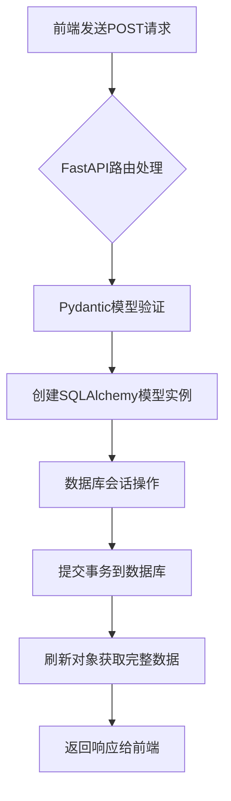

# FastAPI + SQLAlchemy 数据流转过程

## 1. 整体架构概述

FastAPI 结合 SQLAlchemy 实现了从 HTTP 请求接收、数据验证、数据库操作到响应返回的完整数据流转过程。这种组合充分利用了 FastAPI 的自动验证和文档生成能力，以及 SQLAlchemy 的强大 ORM 功能。

## 2. 核心组件

### 2.1 数据模型定义

在 FastAPI + SQLAlchemy 组合中，通常需要定义两种类型的模型：

```python
from pydantic import BaseModel
from sqlalchemy import Column, Integer, String
from sqlalchemy.ext.declarative import declarative_base

# Pydantic 模型用于请求数据验证和响应序列化
class UserCreate(BaseModel):
    username: str
    email: str

class UserResponse(BaseModel):
    id: int
    username: str
    email: str
    
    class Config:
        orm_mode = True  # 允许模型从 ORM 对象中读取数据
                    # 当从路由函数返回 SQLAlchemy 对象时，
                    # FastAPI 使用此配置将 ORM 对象自动转换为 Pydantic 模型

# SQLAlchemy 模型用于数据库操作
Base = declarative_base()

class User(Base):
    __tablename__ = "users"
    
    id = Column(Integer, primary_key=True, index=True)
    username = Column(String, unique=True, index=True)
    email = Column(String, unique=True, index=True)
```

### 2.2 数据库会话管理

```python
from sqlalchemy import create_engine
from sqlalchemy.ext.declarative import declarative_base
from sqlalchemy.orm import sessionmaker

# 创建数据库引擎
SQLALCHEMY_DATABASE_URL = "sqlite:///./test.db"
engine = create_engine(SQLALCHEMY_DATABASE_URL, connect_args={"check_same_thread": False})

# 创建数据库会话类
SessionLocal = sessionmaker(autocommit=False, autoflush=False, bind=engine)

# 依赖注入函数
def get_db():
    db = SessionLocal()
    try:
        yield db
    finally:
        db.close()
```

## 3. 数据流转步骤

### 3.1 接收前端请求

```python
from fastapi import FastAPI, Depends
from sqlalchemy.orm import Session

app = FastAPI()

@app.post("/users/", response_model=UserResponse)
async def create_user(user: UserCreate, db: Session = Depends(get_db)):
    pass
```

- FastAPI 自动解析 HTTP POST 请求体中的 JSON 数据
- `UserCreate` 模型自动验证数据格式
- `Depends(get_db)` 自动注入数据库会话

### 3.2 数据验证与转换

- FastAPI 使用 Pydantic 模型 `UserCreate` 验证请求数据
- 自动进行类型转换和必填字段检查
- 如果验证失败，会自动返回 422 错误

### 3.3 数据库存储操作

```python
from sqlalchemy.exc import IntegrityError

@app.post("/users/", response_model=UserResponse)
async def create_user(user: UserCreate, db: Session = Depends(get_db)):
    # 创建 SQLAlchemy 模型实例
    db_user = User(username=user.username, email=user.email)
    
    try:
        # 数据库会话操作
        db.add(db_user)
        db.commit()
        db.refresh(db_user)
    except IntegrityError:
        db.rollback()
        raise HTTPException(status_code=400, detail="User already exists")
    
    return db_user
```

- 将验证后的数据转换为 `User` 数据库模型实例
- 通过 `Session.add()` 将对象加入数据库会话
- `Session.commit()` 提交事务，持久化数据到数据库
- `Session.refresh()` 刷新对象获取数据库生成的 ID 等信息
- 处理可能的数据库约束错误

### 3.4 响应返回

- FastAPI 自动将 `db_user` 对象序列化为 JSON 格式
- 使用 `UserResponse` 模型定义响应格式
- 返回 HTTP 响应给前端客户端

## 4. 关键特性

### 4.1 自动验证
- 通过 Pydantic 模型实现请求数据自动验证
- 支持复杂的数据结构和嵌套模型
- 自动生成 OpenAPI 文档中的数据结构定义

### 4.2 依赖注入
- 使用 `Depends()` 自动注入数据库会话
- 确保每个请求都有独立的数据库会话
- 自动管理数据库连接的生命周期

### 4.3 异步支持
- 基于 `async/await` 实现高性能异步处理
- 支持异步数据库驱动（如 asyncpg）
- 可以与其他异步操作无缝集成

### 4.4 资源管理
- 通过生成器函数确保数据库连接正确关闭
- 使用 try/finally 保证资源清理
- 避免数据库连接泄露

### 4.5 ORM 优势
- 抽象数据库操作，提高开发效率
- 支持复杂查询和关联操作
- 提供数据库迁移工具（如 Alembic）

## 5. 数据流转图示



## 6. 错误处理

在实际应用中，还需要考虑各种异常情况：

```python
from fastapi import HTTPException

@app.post("/users/", response_model=UserResponse)
async def create_user(user: UserCreate, db: Session = Depends(get_db)):
    # 检查用户是否已存在
    existing_user = db.query(User).filter(User.email == user.email).first()
    if existing_user:
        raise HTTPException(status_code=400, detail="Email already registered")
    
    # 创建用户
    db_user = User(username=user.username, email=user.email)
    
    try:
        db.add(db_user)
        db.commit()
        db.refresh(db_user)
        return db_user
    except Exception as e:
        db.rollback()
        raise HTTPException(status_code=500, detail="Internal server error")
```

## 7. 总结

FastAPI + SQLAlchemy 的数据流转过程体现了现代 Web 开发的最佳实践：

1. **清晰的分层**：数据验证(Pydantic)与数据持久化(SQLAlchemy)分离
2. **自动化程度高**：自动验证、自动序列化、自动生成文档
3. **资源安全**：依赖注入确保数据库连接正确管理
4. **错误处理完善**：提供完整的异常处理机制
5. **类型安全**：全面的类型提示支持开发和维护

这种模式不仅提高了开发效率，还保证了应用的健壮性和可维护性。

## 8. 模型间的关系详解

### 8.1 三个模型的角色分工

在 FastAPI + SQLAlchemy 的数据流转过程中，涉及三种不同的模型，它们各司其职：

1. **UserCreate (Pydantic 输入模型)**:
   - 用于**验证**从前端发送来的请求数据
   - 通常只包含创建对象所必需的字段
   - 不包含数据库自动生成的字段（如 id、created_at 等）

2. **User (SQLAlchemy ORM 模型)**:
   - 表示数据库中的实际记录
   - 包含完整的数据字段，包括自动生成的字段
   - 用于执行数据库操作（增删改查）

3. **UserResponse (Pydantic 输出模型)**:
   - 用于**格式化**返回给前端的数据
   - 可能包含数据库记录的所有字段，也可能排除某些敏感字段
   - 确保返回数据结构的一致性和安全性

### 8.2 数据流转中的转换过程

```
前端请求数据 (JSON) 
    ↓
UserCreate 验证并解析数据
    ↓
从 UserCreate 创建 SQLAlchemy User 对象
    ↓
User 对象保存到数据库，获得自动生成的字段（如 id）
    ↓
通过 orm_mode 将 User 对象转换为 UserResponse
    ↓
返回格式化的 JSON 响应给前端
```

### 8.3 为什么需要独立的输入和输出模型？

尽管 SQLAlchemy User 对象可能是基于 UserCreate 创建的，但我们仍需要独立的 UserResponse 模型的原因：

1. **字段完整性**：UserResponse 包含数据库生成的字段（如 id），而 UserCreate 不包含
2. **数据安全**：可以排除敏感字段（如密码、密钥等）不暴露给前端
3. **格式控制**：确保 API 响应格式的一致性，不受数据库结构变化影响
4. **文档生成**：为 API 文档提供精确的响应结构定义
5. **版本兼容**：允许输入和输出格式独立演进

这种设计遵循了关注点分离的原则，让每个模型都有明确的职责，从而提高代码的可维护性和系统的安全性。

## 8.4 示例
假设有一个用户模型，包含用户名、邮箱和密码：
```python
# 前端发送的数据
{
    "username": "john_doe",
    "email": "john@example.com"
}

# UserCreate 验证这些字段
user_data = UserCreate(username="john_doe", email="john@example.com")

# 创建 SQLAlchemy 对象（数据库中会生成 id）
db_user = User(username=user_data.username, email=user_data.email)
# 此时 db_user.id 为 None，因为还未保存到数据库

# 保存到数据库后，id 字段被填充
db.add(db_user)
db.commit()
db.refresh(db_user)
# 现在 db_user.id 有了值，比如 1

# UserResponse 会包含所有字段
# 通过 orm_mode = True，从 db_user 对象中读取所有字段：
# id = db_user.id (1)
# username = db_user.username ("john_doe")
# email = db_user.email ("john@example.com")
```